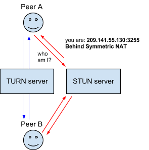

## Table of Contents
- [adapter.js](#adapter.js)
- [webrtc concept and usage](#WebRTC-conceptsand-usage)
- [RTCPeerConnections](#RTCPeerConnections-Interface)
- [Peer Identity](#peer-identity)
- [Introduction to WebRTC protocols](#Introduction-to-webrtc-protocols)
    - [ICE](#ice) ( Interactive Connectivity Establishment )
    - [STUN](#stun) ( Session Traversal Utilities for NAT(STUN) )
    - [NAT](#nat) ( Network Address Translation )
    - [TURN](#turn) ( Traversal using relays around NAT)
    - [SDP](#sdp) ( session description protocol )
- [WebRTC Connectivity](#webrtc-connectivity)
    - [Signaling](#signaling)
    - [Session Description](#session-descriptions)
    - [Pending and Current Descriptons](#pending-and-current-descriptions)
    - [ICE candidates](#ice-candidates)


<br>

## adapter.js ( webrtc Interoperablity )
<hr>
For each version of each browser that supports WebRTC, adapter.js implements the needed polyfills, establishes the non-prefixed names of APIs, and applies any other changes needed to make the browser run code written to the WebRTC specification.

- using adapter.js

    In order to use adapter.js, you need to include adapter.js on any page that uses WebRTC APIs:

    1. Download a copy of the latest version of adapter.js from GitHub.

    2. Place it in your site's directory structure (such as in your scripts directory).

    3. Include adapter.js in your project: <script src="adapter.js"></script>

    4. Write your code, using WebRTC APIs per the specification, knowing that your code should work on all browsers.

    5. Keep in mind that even a good shim like this one doesn't mean you don't need to test your code on different browsers (and ideally different versions of each browser).

<br>

## WebRTC concepts and usage
<hr>

WebRTC serves multiple purposes, together with the Media Capture and Streams API 

- provides multimedia capabilities, including  audio and video conferencing
- file exchange
- screen sharing
- identity management
- interfacing with legacy telephone systems including support for sending DTMF (touch-tone dialing) signals

Connections between peers can be made without requiring any special drivers or plug-ins, and can often be made without any intermediary servers.

Connections between two peers are represented by the RTCPeerConnection interface. Once a connection has been established and opened using RTCPeerConnection, media streams (MediaStreams) and/or data channels (RTCDataChannels) can be added to the connection.

<br>

## RTCPeerConnections Interface
<hr>

The RTCPeerConnection interface represents a WebRTC connection between the local computer and a remote peer. It provides methods to connect to a remote peer, maintain and monitor the connection, and close the connection once it's no longer needed.

[MDN RTCPeerConnection Interface Link](https://developer.mozilla.org/en-US/docs/Web/API/RTCPeerConnection)

<br>

## Peer Identity
<hr>

Note: The promise returned by setRemoteDescription() cannot resolve until any target peer identity that's been set is validated. If the identity hasn't been validated yet, the promise returned by setRemoteDescription() will be rejected. If there's no target peer identity, setRemoteDescription() doesn't need to wait for validation to occur before it resolves.

```
    let pc = new RTCPeerConnection();

    /* ... */

    async function getIdentityAssertion(pc) {
    try {
        const identity = await pc.peerIdentity;
        return identity;
    } catch(err) {
        console.log("Error identifying remote peer: ", err);
        return null;
    }
    }
```

<br>

## Introduction to WebRTC protocols

<hr>

- ### ICE
    Interactive Connectivity Establishment (ICE) is a framework to allow your web browser to connect with peers. There are many reasons why a straight up connection from Peer A to Peer B won’t work. It needs to bypass firewalls that would prevent opening connections, give you a unique address if like most situations your device doesn’t have a public IP address, and relay data through a server if your router doesn’t allow you to directly connect with peers. ICE uses STUN and/or TURN servers to accomplish this, as described below.

- ### STUN

    Session Traversal Utilities for NAT (STUN) (acronym within an acronym) is a protocol to discover your public address and determine any restrictions in your router that would prevent a direct connection with a peer.

    The client will send a request to a STUN server on the Internet who will reply with the client’s public address and whether or not the client is accessible behind the router’s NAT.

    

- ### NAT

    Network Address Translation (NAT) is used to give your device a public IP address. A router will have a public IP address and every device connected to the router will have a private IP address. Requests will be translated from the device’s private IP to the router’s public IP with a unique port. That way you don’t need a unique public IP for each device but can still be discovered on the Internet.

    Some routers will have restrictions on who can connect to devices on the network. This can mean that even though we have the public IP address found by the STUN server, not anyone can create a connection. In this situation we need to turn to TURN.

- ### TURN

    Some routers using NAT employ a restriction called ‘Symmetric NAT’. This means the router will only accept connections from peers you’ve previously connected to.

    Traversal Using Relays around NAT (TURN) is meant to bypass the Symmetric NAT restriction by opening a connection with a TURN server and relaying all information through that server. You would create a connection with a TURN server and tell all peers to send packets to the server which will then be forwarded to you. This obviously comes with some overhead so it is only used if there are no other alternatives.

    


- ### SDP 

    Session Description Protocol (SDP) is a standard for describing the multimedia content of the connection such as resolution, formats, codecs, encryption, etc. so that both peers can understand each other once the data is transferring. This is, in essence, the metadata describing the content and not the media content itself.

    Technically, then, SDP is not truly a protocol, but a data format used to describe connection that shares media between devices.

    Documenting SDP is well outside the scope of this documentation; however, there are a few things worth noting here.

    - Structure
    
       SDP consists of one or more lines of UTF-8 text, each beginning with a one-character type, followed by an equals sign ("="), followed by structured text comprising a value or description, whose format depends on the type. The lines of text that begin with a given letter are generally referred to as "letter-lines". For example, lines providing media descriptions have the type "m", so those lines are referred to as "m-lines."


<br>

## WebRTC connectivity
<hr>

- ### Signaling

    Unfortunately, WebRTC can’t create connections without some sort of server in the middle. We call this the signal channel or signaling service. It’s any sort of channel of communication to exchange information before setting up a connection, whether by email, post card or a carrier pigeon... it’s up to you.

    The information we need to exchange is the Offer and Answer which just contains the SDP mentioned below.

    Peer A who will be the initiator of the connection, will create an Offer. They will then send this offer to Peer B using the chosen signal channel. Peer B will receive the Offer from the signal channel and create an Answer. They will then send this back to Peer A along the signal channel.

- ### Session Descriptions

    The configuration of an endpoint on a WebRTC connection is called a session description. The description includes information about the kind of media being sent, its format, the transfer protocol being used, the endpoint's IP address and port, and other information needed to describe a media transfer endpoint. This information is exchanged and stored using Session Description Protocol (SDP); if you want details on the format of SDP data, you can find it in RFC 2327.

    When a user starts a WebRTC call to another user, a special description is created called an offer. This description includes all the information about the caller's proposed configuration for the call. The recipient then responds with an answer, which is a description of their end of the call. In this way, both devices share with one another the information needed in order to exchange media data. This exchange is handled using Interactive Connectivity Establishment (ICE, a protocol which lets two devices use an intermediary to exchange offers and answers even if the two devices are separated by Network Address Translation (NAT).

    Each peer, then, keeps two descriptions on hand: the local description, describing itself, and the remote description, describing the other end of the call.

    The offer/answer process is performed both when a call is first established, but also any time the call's format or other configuration needs to change. Regardless of whether it's a new call, or reconfiguring an existing one, these are the basic steps which must occur to exchange the offer and answer, leaving out the ICE layer for the moment:

    The caller captures local Media via navigator.mediaDevices.getUserMedia() 
    The caller creates RTCPeerConnection and called RTCPeerConnection.addTrack() (Since addStream is deprecating)
    The caller calls RTCPeerConnection.createOffer() to create an offer.
    The caller calls RTCPeerConnection.setLocalDescription() to set that offer as the local description (that is, the description of the local end of the connection).
    After setLocalDescription(), the caller asks STUN servers to generate the ice candidates
    The caller uses the signaling server to transmit the offer to the intended receiver of the call.
    The recipient receives the offer and calls RTCPeerConnection.setRemoteDescription() to record it as the remote description (the description of the other end of the connection).
    The recipient does any setup it needs to do for its end of the call: capture its local media, and attach each media tracks into the peer connection via RTCPeerConnection.addTrack()
    The recipient then creates an answer by calling RTCPeerConnection.createAnswer().
    The recipient calls RTCPeerConnection.setLocalDescription(), passing in the created answer, to set the answer as its local description. The recipient now knows the configuration of both ends of the connection.
    The recipient uses the signaling server to send the answer to the caller.
    The caller receives the answer.
    The caller calls RTCPeerConnection.setRemoteDescription() to set the answer as the remote description for its end of the call. It now knows the configuration of both peers. Media begins to flow as configured.

- ### Pending and Current Descriptions

    Taking one step deeper into the process, we find that localDescription and remoteDescription, the properties which return these two descriptions, aren't as simple as they look. Because during renegotiation, an offer might be rejected because it proposes an incompatible format, it's necessary that each endpoint have the ability to propose a new format but not actually switch to it until it's accepted by the other peer. For that reason, WebRTC uses pending and current descriptions.

    The current description (which is returned by the RTCPeerConnection.currentLocalDescription and RTCPeerConnection.currentRemoteDescription properties) represents the description currently in actual use by the connection. This is the most recent connection that both sides have fully agreed to use.

    The pending description (returned by RTCPeerConnection.pendingLocalDescription and RTCPeerConnection.pendingRemoteDescription) indicates a description which is currently under consideration following a call to  setLocalDescription() or setRemoteDescription(), respectively.

    When reading the description (returned by RTCPeerConnection.localDescription and RTCPeerConnection.remoteDescription), the returned value is the value of pendingLocalDescription/pendingRemoteDescription if there's a pending description (that is, the pending description isn't null); otherwise, the current description (currentLocalDescription/currentRemoteDescription) is returned.

    When changing the description by calling setLocalDescription() or setRemoteDescription(), the specified description is set as the pending description, and the WebRTC layer begins to evaluate whether or not it's acceptable. Once the proposed description has been agreed upon, the value of currentLocalDescription or currentRemoteDescription is changed to the pending description, and the pending description is set to null again, indicating that there isn't a pending description.

    The pendingLocalDescription contains not just the offer or answer under consideration, but any local ICE candidates which have already been gathered since the offer or answer was created. Similarly, pendingRemoteDescription includes any remote ICE candidates which have been provided by calls to RTCPeerConnection.addIceCandidate().

    See the individual articles on these properties and methods for more specifics, and Codecs used by WebRTC for information about codecs supported by WebRTC and which are compatible with which browsers. The codecs guide also offers guidance to help you choose the best codecs for your needs.

- ### ICE candidates

    
